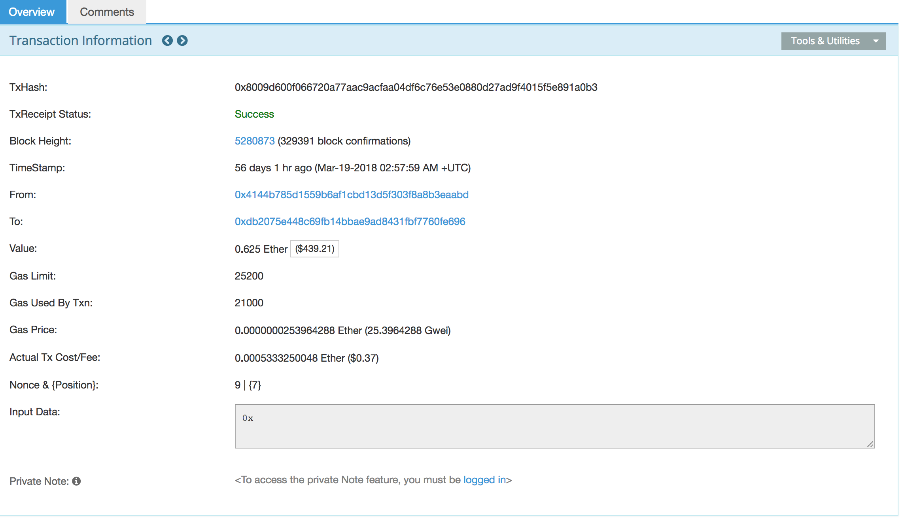
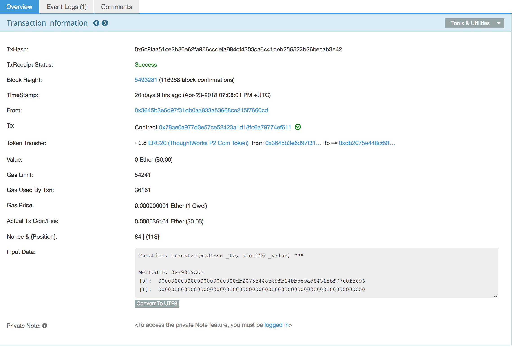

Vehicle ERC721
===
Please install metamask and then get some ether from rinkeby from https://faucet.rinkeby.io/.

## Prerequisite
install dependency
```
$ npm install
```

## Deploy to rinkeby
```
$ export METAMASK_MNEMONIC="law profit smile clarify ...." # 12 mnemonic words
$ truffle deploy --network rinkeby
```

## Verify issue a vehicle tx in development network
According to ethereum tx model, what we must know is the different meanings of token transfer and ethereum smart contract calling tx.

First of all, we need to know how smart contract is working on ethereum. Roughly speaking, we actually send a tx to smart contract when we're calling a function in the smart contract. The primitive under `calling` is just like sending an ether to others and the only difference is sending ether tx without anything in `Input Data` field of the tx, but calling a smart contract function does have the function information in `Input Data` like `Function: transfer(address _to, uint256 _value)`. please see the below picture:

1. sending ether

2. calling function


So the second important question is how token transfer happened in ethereum? No magic here, we just change the smart contract's state variable `tokenOwner`, this variable is a hashmap-like data structure called `mapping` in Solidity.

Imagine a scenario, Alice transfer a token to Bob. Alice may call a function `transferFrom(from, to, tokenId)`, now the ethereum will have a tx, which from Alice's address and to a smart contract's address with the funtion definition in `Input Data`. Then it's brodacasting in etheruem network and each node will *verify* this tx with runing `transferFrom(from, to, tokenId)` on their evm. When no exception thrown, the `tokenOwner` state variable's been changed like `tokenOwner[tokenId] = to`. A state variable is an item of data held in permanent storage. That storage structure (called the State) is essentially one huge array of bytes with an address range from 0 to 2256. Each address can hold a data word of 32bytes/256bits called a slot. Each contract can use this address space to store its functional data, its 'state'.

As the above mentioned, we would not see how a token has been transferred, we only can see who calls the `transferFrom` funciton as a tx in ethereum network. But fortunately, we could emit customized event in code and persist the event logs in transaction receipt for further review.

So the question is narrowed to how to extract event logs by transactions' hash.
### How to extract event logs
The way to extract event logs is not so easy from web3's point view.

Use Vehicle contract as an example:

#### 1. deploy to development network
```
$ truffle develop # start ganache (development network) in local
$ truffle deploy
saved...
```
#### 2. manipulate contract in console

```
$ truffle console

truffle(development)> 

# 1. upgrade web3
var Web3 = require('web3')
var _web3 = new Web3(web3.currentProvider)

# 2. get deployed vehicle address.
var v = Vehicle.deployed()

# 3. issue a vehicle and stringify tx.
v.then(v => v.issue('00000001kafa')).then(tx => JSON.stringify(tx)) 
# output: stringify tx
{
    "tx": "0x7bf2eb6b05e122b291a520e9958c0f4195d4382e58151206045252445fe6fc81",
    "receipt": {
        "transactionHash": "0x7bf2eb6b05e122b291a520e9958c0f4195d4382e58151206045252445fe6fc81",
        "transactionIndex": 0,
        "blockHash": "0x52ffc09ac793624beba0700ed15b01a15abcf890ca2fcfb6b7ca83e976418e5c",
        "blockNumber": 5,
        "gasUsed": 171607,
        "cumulativeGasUsed": 171607,
        "contractAddress": null,
        "logs": [{
            "logIndex": 0,
            "transactionIndex": 0,
            "transactionHash": "0x7bf2eb6b05e122b291a520e9958c0f4195d4382e58151206045252445fe6fc81",
            "blockHash": "0x52ffc09ac793624beba0700ed15b01a15abcf890ca2fcfb6b7ca83e976418e5c",
            "blockNumber": 5,
            "address": "0xf12b5dd4ead5f743c6baa640b0216200e89b60da",
            "data": "0x00000000000000000000000000000000000000000000000000000000000000400000000000000000000000000000000000000000000000000000000000000001000000000000000000000000000000000000000000000000000000000000000c30303030303030316b6166610000000000000000000000000000000000000000",
            "topics": ["0xaf3bf086eea81c0aa694cc7cb58d9dc4e5366dc2b7ceccb8eaef33736eaa26ff", "0x000000000000000000000000627306090abab3a6e1400e9345bc60c78a8bef57"],
            "type": "mined"
        }, {
            "logIndex": 1,
            "transactionIndex": 0,
            "transactionHash": "0x7bf2eb6b05e122b291a520e9958c0f4195d4382e58151206045252445fe6fc81",
            "blockHash": "0x52ffc09ac793624beba0700ed15b01a15abcf890ca2fcfb6b7ca83e976418e5c",
            "blockNumber": 5,
            "address": "0xf12b5dd4ead5f743c6baa640b0216200e89b60da",
            "data": "0x0000000000000000000000000000000000000000000000000000000000000001",
            "topics": ["0xddf252ad1be2c89b69c2b068fc378daa952ba7f163c4a11628f55a4df523b3ef", "0x0000000000000000000000000000000000000000000000000000000000000000", "0x000000000000000000000000627306090abab3a6e1400e9345bc60c78a8bef57"],
            "type": "mined"
        }],
        "status": "0x01",
        "logsBloom": "0x00000000000000000000000000000000000000000000000000000000000000000000000000000000000400200000000000000000000000000000000000000000000000000000000010000008000000000000000000000000000000000080000000000000020000000000000000000800000000000000000000000010000000000000000000000000000000000000000000000000000000000000010000000002000000000000000000000000000000000000040000000000000000000000000000000002000000000000000000000000000000000000000000000000040020000000000000000000000000000000000000000000000000200000000000000000"
    },
    "logs": [{
        "logIndex": 0,
        "transactionIndex": 0,
        "transactionHash": "0x7bf2eb6b05e122b291a520e9958c0f4195d4382e58151206045252445fe6fc81",
        "blockHash": "0x52ffc09ac793624beba0700ed15b01a15abcf890ca2fcfb6b7ca83e976418e5c",
        "blockNumber": 5,
        "address": "0xf12b5dd4ead5f743c6baa640b0216200e89b60da",
        "type": "mined",
        "event": "VehicleIssue",
        "args": {
            "_owner": "0x627306090abab3a6e1400e9345bc60c78a8bef57",
            "_vehicle": "00000001kafa",
            "_tokenId": "1"
        }
    }, {
        "logIndex": 1,
        "transactionIndex": 0,
        "transactionHash": "0x7bf2eb6b05e122b291a520e9958c0f4195d4382e58151206045252445fe6fc81",
        "blockHash": "0x52ffc09ac793624beba0700ed15b01a15abcf890ca2fcfb6b7ca83e976418e5c",
        "blockNumber": 5,
        "address": "0xf12b5dd4ead5f743c6baa640b0216200e89b60da",
        "type": "mined",
        "event": "Transfer",
        "args": {
            "_from": "0x0000000000000000000000000000000000000000",
            "_to": "0x627306090abab3a6e1400e9345bc60c78a8bef57",
            "_tokenId": "1"
        }
    }]
}

# 4. use web3 decodeLog function to recover a token transfer event
_web3.eth.abi.decodeLog([{type: 'address', name: '_owner', indexed: true}, {type: 'string', name: '_vehicle'}, {type: 'uint256', name
: '_tokenId'}], # event type definition
'0x0000000000000000000000000000000000000000000000000000000000000040000000000000000000000000000000000000000000000000000000000000000100000000
0000000000000000000000000000000000000000000000000000000c30303030303030316b6166610000000000000000000000000000000000000000' # data, ["0xaf3bf086eea81c0aa694cc7cb58d9dc4e5366dc2b7ceccb8eaef33736eaa26ff", # topic
 "0x000000000000000000000000627306090abab3a6e1400e9345bc60c78a8bef57" # indexed topic
 ])

# output: log data
Result {
  '0': '0xB58D9DC4e5366dc2b7CEccB8EAEF33736EAA26ff',
  '1': '00000001kafa',
  '2': '1',  __length__: 3,  _owner: '0xB58D9DC4e5366dc2b7CEccB8EAEF33736EAA26ff',  _vehicle: '00000001kafa',  _tokenId: '1' }
```

## Conclusion
In conclusion, token transfer in ethereum is not easy to trace even if the fact happened on who transfer a token to whom.